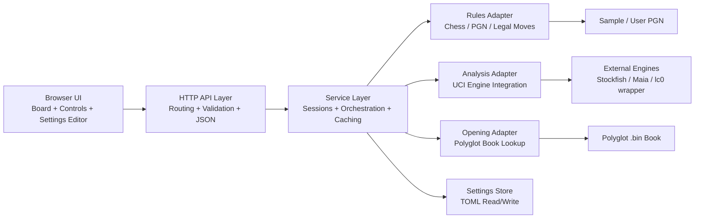
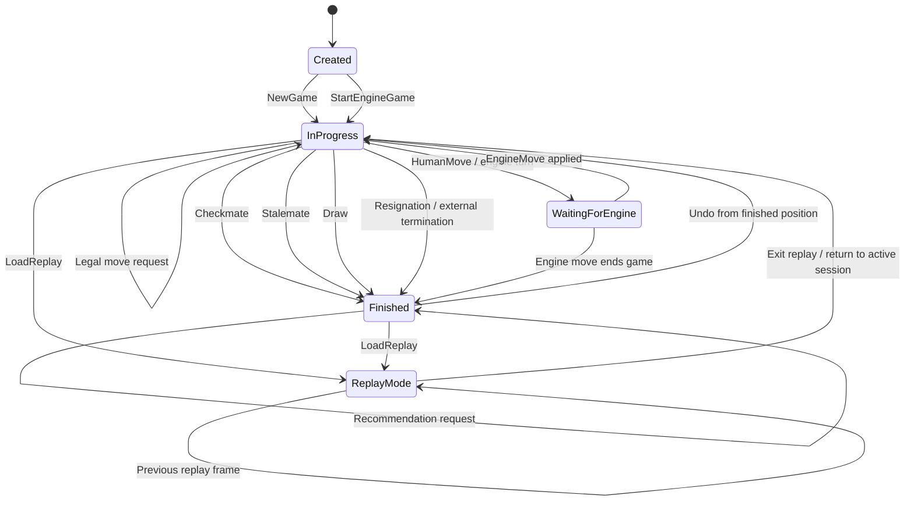

# VeldAtlas Architecture

## 1. Purpose

VeldAtlas is a browser-based chess frontend backed by a Go application.
The design intentionally keeps the browser layer simple while centralizing chess,
analysis, replay, opening-book, and settings logic in the backend.

Main architectural characteristics:

- thin web UI
- single Go backend process
- in-memory sessions
- adapter boundaries around chess and engine integration
- TOML-backed settings persistence

---

## 2. Architectural goals

The design goals are:

1. **Keep frontend logic minimal**
2. **Keep backend orchestration readable and testable**
3. **Isolate external chess / engine libraries behind interfaces**
4. **Allow runtime settings to change without code changes**
5. **Support both analysis and play-vs-engine flows**
6. **Blend recommendations from multiple sources cleanly**

---

## 3. High-level architecture diagram



The browser calls HTTP endpoints only. The service layer owns the main orchestration
logic. External dependencies are isolated through adapters.

---

## 3.1 Session flow diagram

The following diagram shows the lifecycle of a session in VeldAtlas, including:

- normal game creation
- play-vs-engine session creation
- move handling
- undo / redo
- analysis caching
- recommendation retrieval
- replay loading

```mermaid
flowchart TD
    A[User / Browser] --> B[HTTP API]

    %% Session creation
    B --> C{Action}
    C -->|POST /api/game/new| D[Service.NewGame]
    C -->|POST /api/game/new-vs-engine| E[Service.StartEngineGame]

    D --> F[RulesEngine.NewGame]
    F --> G[Create in-memory session]
    G --> H[Return Session]

    E --> F
    E --> I[Set session mode: PlayingAgainstEngine]
    I --> J{Human color = black?}
    J -->|Yes| K[Service.EngineMove]
    J -->|No| H
    K --> L[AnalysisEngine.ChooseMove]
    L --> M[PlayNoReply]
    M --> H

    %% Move flow
    C -->|POST /api/game/{id}/move| N[Service.Play]
    N --> O[RulesEngine.ApplyMoves]
    O --> P[Update session moves + snapshot]
    P --> Q{Play vs engine and engine turn?}
    Q -->|Yes| K
    Q -->|No| H

    %% Undo / Redo
    C -->|POST /api/game/{id}/undo| R[Service.Undo]
    R --> S[Rebuild snapshot from remaining moves]
    S --> H

    C -->|POST /api/game/{id}/redo| T[Service.Redo]
    T --> U[Reapply next redo move]
    U --> H

    %% Legal moves
    C -->|GET /api/game/{id}/legal| V[Service.Legal]
    V --> W[RulesEngine.LegalMoves]
    W --> H

    %% Analysis
    C -->|POST /api/game/{id}/analysis| X[Service.Analyze]
    X --> Y{Cache hit?}
    Y -->|Yes| Z[Return cached analysis]
    Y -->|No| AA[AnalysisEngine.Analyze]
    AA --> AB[Store analysis in cache]
    AB --> H

    %% Recommendations
    C -->|GET /api/game/{id}/recommendations| AC[Service.Recommendations]
    AC --> AD[OpeningBook.Recommend]
    AC --> X
    AD --> AE[Blend book + engine suggestions]
    Z --> AE
    AB --> AE
    AE --> H

    %% Replay
    C -->|POST /api/replay/load| AF[Service.LoadReplay]
    AF --> AG[RulesEngine.LoadPGN]
    AG --> AH[Return replay frames]
    AH --> H
```

```md
This diagram focuses on session-oriented behavior. A session is always created in-memory first, then updated through move, undo, redo, analysis, recommendation, and replay flows. In play-vs-engine mode, the service layer decides whether an automatic engine reply is needed after a human move. Analysis caching is position-based rather than ply-based, so the same ply number in different lines does not accidentally reuse incorrect engine analysis.
```

## 3.2 Session state transition diagram

The following state diagram shows how a session moves between states during:

- normal play
- play-vs-engine mode
- undo / redo
- replay loading
- game completion



```md
This diagram focuses on the logical state of a session. Most requests such as analysis, legal-move lookup, and recommendations do not change the session state; they operate on the current snapshot. Undo can move a session from `Finished` back to `InProgress`, because removing the last move may reopen the game. In play-vs-engine mode, the session temporarily enters `WaitingForEngine` after a human move if the next turn belongs to the configured engine.
```

## 4. Package structure

```text
cmd/veldatlas/                  program entrypoint
internal/config/               settings schema and TOML persistence
internal/domain/               interfaces and shared DTOs
internal/service/              orchestration layer
internal/httpapi/              HTTP handlers
internal/adapters/corentings/  rules + engine integration adapter(s)
internal/adapters/opening/     Polyglot opening-book integration
web/                           browser assets
samples/                       bundled PGN examples
docs/                          architecture and settings documentation
```

---

## 5. Core domain concepts

### 5.1 Session

A session represents one active game in memory.

A session contains:

- session id
- move history
- redo stack
- current snapshot
- current mode (normal or play-vs-engine)

### 5.2 Snapshot

A snapshot is the backend-facing representation of a position.

It contains:

- FEN
- side to move
- game status
- outcome / method (if available)
- optional headers
- move labels / move list context

### 5.3 Recommendation panel

A recommendation panel combines:

- opening-book recommendations
- engine recommendations

This lets the frontend render one unified section without understanding multiple
backend sources.

### 5.4 Analysis cache

The analysis cache stores engine analysis lines by:

- engine name
- FEN
- difficulty
- normalized engine option set

This is intentionally **position-based**, not **ply-based**.

---

## 6. Main interfaces

The service layer depends on these abstractions:

### 6.1 `RulesEngine`

Responsibilities:

- start a new game
- apply move sequences
- return legal moves for a square
- load PGN replay data

### 6.2 `AnalysisEngine`

Responsibilities:

- analyze a position
- choose a move for engine play

### 6.3 `OpeningBook`

Responsibilities:

- return opening-book recommendations for a position

### 6.4 `SettingsStore`

Responsibilities:

- return current settings
- persist updated settings

---

## 7. Request flows

### 7.1 New game flow

1. frontend calls `POST /api/game/new`
2. HTTP handler calls `service.NewGame()`
3. service calls `RulesEngine.NewGame()`
4. session is created and stored in memory
5. response returns the session snapshot

### 7.2 Make move flow

1. frontend calls `POST /api/game/{id}/move`
2. service appends the move to session history
3. service calls `RulesEngine.ApplyMoves()`
4. snapshot is updated
5. if session mode is play-vs-engine and it is now the engine’s turn,
   service triggers `EngineMove()`
6. updated session is returned

### 7.3 Analyze flow

1. frontend calls `POST /api/game/{id}/analysis`
2. service builds a cache key from current FEN / engine / difficulty / options
3. if cached, cached result is returned
4. otherwise service calls `AnalysisEngine.Analyze()`
5. result is cached and returned

### 7.4 Recommendation flow

1. frontend calls `GET /api/game/{id}/recommendations`
2. service retrieves book recommendations from `OpeningBook`
3. service retrieves engine recommendations from `Analyze()`
4. both are merged into one `RecommendationPanel`
5. response is returned as one payload

### 7.5 Play-vs-engine flow

1. frontend calls `POST /api/game/new-vs-engine`
2. service creates a normal session
3. session mode is set to `PlayingAgainstEngine=true`
4. if human color is black, engine immediately chooses a move
5. when the human moves, service automatically triggers engine reply if appropriate

### 7.6 Replay flow

1. frontend calls `POST /api/replay/load`
2. service delegates to `RulesEngine.LoadPGN()`
3. replay frames are returned
4. frontend steps through replay frames locally

---

## 8. Opening-book architecture

The opening-book integration is intentionally separated from engine analysis.

Responsibilities of the opening-book adapter:

- load a Polyglot `.bin` file
- compute the current position hash
- lookup matching entries
- decode moves to UCI
- sort by weight descending
- calculate percentages from total weight

This keeps opening recommendations deterministic and fast.

---

## 9. Settings architecture

Settings are stored in TOML and loaded into structured Go types.

The settings model includes:

- listen address
- opening-book path
- engine definitions
- engine options
- UI defaults

### Why TOML here

TOML works well for this use case because:

- it is easy to read and edit manually
- nested structures map cleanly to Go structs
- it is suitable for application configuration rather than data interchange

---

## 10. Engine configuration model

Each configured engine has:

- enabled flag
- executable path
- default difficulty
- play eligibility flag
- arbitrary option map

This keeps the application generic:

- Stockfish can be configured with UCI options like `Skill Level`, `Threads`, `Hash`, etc.
- Maia-like runtimes can be configured with weights paths or wrapper-specific options

The service layer does not need to understand engine-specific options in detail.
It simply passes them through the analysis adapter.

---

## 11. State management

Current runtime state is in-memory only.

### Stored in memory

- sessions
- session analysis caches

### Persisted to disk

- settings TOML

### Not persisted yet

- games
- replay history
- cached analysis across restarts

This keeps the implementation simple, but also means restarting the application
will drop active sessions and runtime caches.

---

## 12. Error-handling strategy

The application uses typed service-level errors for common cases:

- session not found
- no undo available
- no redo available
- engine not configured

The HTTP layer maps them consistently to:

- `404` for missing session
- `400` for invalid operation / configuration issues

This keeps the frontend logic simple.

---

## 13. Testing strategy

The design is intentionally testable because the service depends on interfaces.

### Unit test focus

- session lifecycle
- engine auto-reply behavior
- analysis caching behavior
- recommendation blending
- error handling

### Handler test focus

- HTTP request / response mapping
- settings endpoints
- game endpoints
- replay endpoints
- recommendation payloads

### Adapter test focus

- Polyglot lookup
- decoding and weighting behavior
- version-sensitive integration points

---

## 14. Trade-offs in the current design

### Advantages

- simple and understandable
- easy to test
- small frontend surface
- backend owns the important logic
- clear adapter boundaries

### Limitations

- sessions are not persisted
- analysis cache is process-local only
- one-process architecture only
- engine execution strategy is intentionally simple
- exact external-library alignment may require a small version-specific adapter pass

---

## 15. Future evolution options

Natural next steps include:

1. persistent session storage
2. persistent analysis cache
3. richer replay annotation support
4. arrows / board annotations in the UI
5. engine option discovery from actual UCI engine startup
6. richer Polyglot controls (random weighted pick, top move thresholds, etc.)
7. multiple book support
8. multiple concurrent engine profiles

---

## 16. Summary

VeldAtlas follows a simple architecture:

- thin frontend
- HTTP adapter layer
- service orchestration core
- external dependencies isolated behind interfaces
- TOML configuration
- in-memory runtime state

That makes it a good foundation for iterative growth without turning the first version
into a large, over-engineered system.
